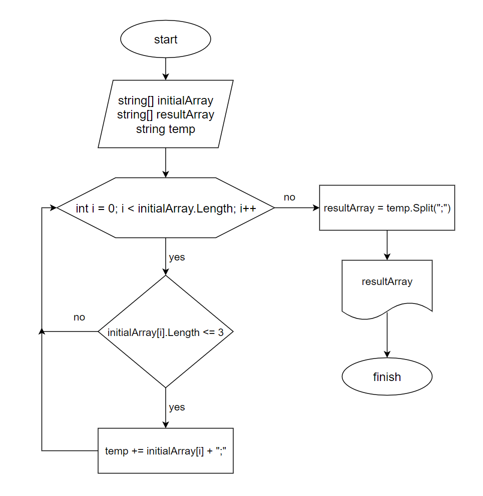

# Выбор специализации. Итоговый проект.

## Задача

Написать программу, которая из имеющегося массива строк формирует массив из строк, длина которых меньше либо равна 3 символа. Первоначальный массив можно ввести с клавиатуры, либо задать на старте выполнения алгоритма. При решении не рекомендуется пользоваться коллекциями, лучше обойтись исключительно массивами.

### Пример результата

["hello", "2", "world", ":-)"] -> ["2", ":-)"]

["1234", "1567", "-2", "computer science"] -> ["-2"]

["Russia", "Denmark", "Kazan"] -> []

## Блок-схема алгоритма

## Описание решения

Задаем текстовый массив, в котором будет осуществляться поиск элементов с длиной меньше или равной 3. 
В цикле обходим все элементы заданного массива. Если количество символов элемента меньше или равно 3, то добавляем этот элемент во временную текстовую переменную и точку-с-запятой как разделитель.
Далее, разбиваем полученую строку по разделителю на элементы массива с помощью метода Split(). 

### Альтернативное решение

Можно решить данную задачу за два прохода. На первом проходе подсчитываем количество элементов с длиной меньше либо равной 3. 
Затем создаем пустой массив размерностью равной найденому значению. На втором проходе заполняем этот массив непосредственно самими значениями элементов, у которых количество символов меньше или равно 3.

## *Изменения

В финальной версии программы, было решено заменить разделитель с ";" на "\<separator\>". Так как точка-с-запятой может с высокой долей вероятности встретиться в строке элемента массива.